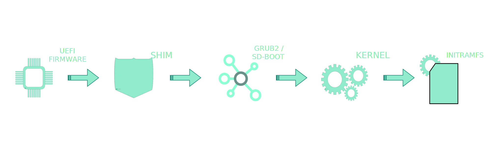
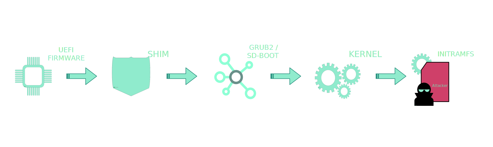
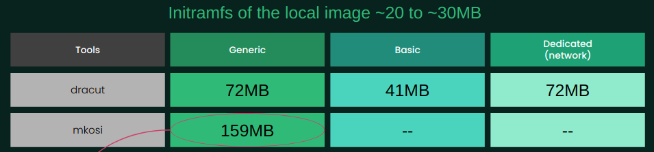

# Static Initramfs

> * **Author**: Valentin LEFEBVRE <valentin.lefebvre@suse.com>
> * **Created at**: 2024-04-21
> * **Updated at**: 2024-04-21
> * **Description**: Build and Sign a static Initramfs

## I - Why Are we talking about signing the initramfs

### Boot chain



Here are the steps followings the power up of a machine:

* **system firmware** will do minimal hardware initialization, and hand control over to a boot loader stored on a persistent storage device.
* **Shim**, the bootloader signed by Microsoft key is used to load boot-loaders included into this allow-list called Machine Owner Key list (MOK list)
* It loads known signed bootloader as **Grub2** or **systemd-boot**.
* Previous boot loader will then load the **kernel** as well as an **initramfs** from disk (or the network) and will finally invoke the freshly loaded kernel.

### Initramfs not secure



The initramfs is a compressed archive generated by **dracut**. It contains the minimal set of services needed in order to mount the root file system and in this case the initramfs can only be used by the system it was generated on.
Therefore, as build locally in the machine, it cannot be sign by the vendor. The bootchain isn't entirely secure and then an attacker could change or corrupt your cpio archive.

### Goals

To secure more the boot chain, idea would be to construct a **static** initramfs from the vendor side, to let him **sign** it. Let's see how we can build one and sign it using the **OpenBuildService** (OBS).

## II - Build an Initramfs

### Building process

* Vendor's build service, the OpenBuildService (OBS) for our case, will need to create a **static** initramfs, where no more regeneration will be made on the installed machine. The build service will take in charge the **signing** process. So let's create a **package** to install the sign static initramfs through the packaging process, and let's provide the certificate that has been used to sign it. It will be enrolled to the MOK.
* More than create a static initramfs, we need to create a **generic** one, no "host-only", no minimal anymore, to be adapted for the most use-cases. Of course, consequences with that would be to get an initramfs that didn't contains anymore the minimal set of service needed, Therefore, the initramfs size, as for the boot time, will be impacted negatively.
* We can think to create **dedicated** initramfs, where it will includes modules for a specific use-case. For example, an initramfs used in cloud images, where it needs some networks modules.

### Tools to use

#### Dracut

**Dracut** Is a tool we already use (at SUSE) to create the initramfs that is in used in a basic image. It uses Shell scripts to work and allows building an initramfs with what is available where it is run.

```bash
dracut
  --confdir $(mktemp -d)
  --conf=file.conf
  --kernel-image /boot/%{ker_name}
  --kver %{uname}
  --kmoddir /lib/modules/%{uname}
  --fwdir /lib/firmware
  --no-hostonly
  --no-hostonly-cmdline
  --no-hostonly-default-device
  --kernel-cmdline "rw security=apparmo rd.multipath=0"
  --omit "iscsi multipath memstack"
  --show-modules
  --add-drivers="fat vfat"
  --filesystems="vfat ext4 xfs btrfs overlay"
  ./initramfs-%{uname}
```

* With the **conf** argument, we can provide a config file to adjust our initramfs, for example adding a *'dracutmodules+="module1 module2"'* to provide a dedicated list of modules to includes
* Three **uefi\*** arguments are made to create, from the dracut's point of view, a generic initramfs that will not check of what is available the environment. That will be our main arguments to build our generic one!

#### mkosi

**mkosi** a tool developed by systemd, written in Python, can create also an initramfs. The main difference with the previous tool, it works on the package level, it means that to create an initramfs, you will need to provide a list of packages to include (compare to list of "module" with dracut). Also, it needs by default an internet connection to work properly.

```bash
mkosi
--image-id=inird
--cache=./mkosi.cache
--compress=xz
--format=cpio
--base-packages=conditional
--package="pkg_1, pkg_2, pkg_3"
--remove-files="..."
--image-version=%{uname}
--environment=KERNEL_VERSION=%{uname}
--with-network=never
--local-mirror=$repodir
--repository-key-check=false
--finalize-script=finalize.suse
-o ./initramfs-%{uname}
```

#### Comparison

* Dracut
  * Already known and use to create the local initramfs.
  * Adapted to OBS, easy to use, just need to provide in BuildRequired of your build, what is needed for your modules.
* Mkosi
  * Not adapted to OBS, need to do a workaround to work offline (because in the build environment, you will not have access to the network). You will need to provide all rpms into a local mirror repository and link to the command.
  * Working with packages allows having more predictability, however the initramfs generated becomes bigger. You will need to provide script to finalize the generation (removing docs, man files unneeded for an initramfs, remove the kernel if you provide kernel driver through the kernel package as it is done for suse distribution ...).
  * New for now.

Using mkosi allows creating a static initramfs in our project in OBS. Moreover there is more and more work around this tool. But following the comparison just below, I will keep using `dracut` cmd for the next project.

### Building on OBS

* OBS Package has been developed [here](https://build.opensuse.org/package/show/home:vlefebvre:unified/initrd-dracut)
* With the feature of **Multibuild** in one specfile, I produce multiple RPM. Each flavour will get a specific list of **BuildRequires** following by a specific list of modules to install into the initramfs. That allows to create some **dedicated** ones.
  * **generic flavour**: build the static generic initramfs, that should run for majority of use-case.
  * **basic flavour**: build the basic initramfs where it contains a minimal stuff and should be run for some of the use-cases.
  * **network flavour**: build an example of a dedicated initramfs that includes all networks modules.
* Just calling then the `dracut` cmd in the `%build` section do the job
* list of created RPMs:
  * initrd-dracut-base-0.1.0_k6.8.7-2.158.x86_64.rpm
  * initrd-dracut-generic-0.1.0_k6.8.7-2.151.x86_64.rpm
  * initrd-dracut-network-0.1.0_k6.8.7-2.158.x86_64.rpm

#### Size of a static initramfs



## III - Sign the static initramfs

### OBS signing feature

OBS allows signing binaries in the build environment. For that we need to provides `#needssslcertforbuild` at the top of our specfile. That tells OBS that we are going to use his signature process (it uses `pesign` tool).

It will provide the certificate used to sign file in the source directory. In that way we can use it and provides the certificate through the files to install. It will be needed when we install the package to be able to enroll the certificate in our machine.

Then We need to use the `BRP_PESIGN_FILES` macro to tell OBS which files to sign.

### Format type issue

The problem is, that the generated initramfs isn't a binary file but a **cpio archive**, so the OBS signing feature cannot be applied.

The solution has been to patch Grub2 to provide:

* a tool to wrap the archive to a binary file `grub2-wrap`
* new grub2 command to unwrap the initramfs, check the signature and get the initial archive. `grub_unwrap_init()`

Patches have been included into the unified OBS project [see here](https://build.opensuse.org/package/show/home:vlefebvre:unified/grub2)

## IV - Sign Generic initramfs package

```bash
$ rpm -ql /[...]/x86_64/initrd-dracut-generic-0.1.0_k6.8.5-2.147.x86_64.rpm

/boot/initrd-dracut-generic-6.8.5-1-default
/usr/share/initrd
/usr/share/initrd/certs
/usr/share/initrd/certs/981EA8B3-initrd-dracut-generic.crt
```

After the installation of the proposal package, it will install the sign generic initramfs in the boot partition and then asked to enroll the key to the MOK using the following command:

```bash
mokutil --import ${PATH_TO_CRT}
```

All you need to do then, is to add a new bootloader entry that load this initramfs.
