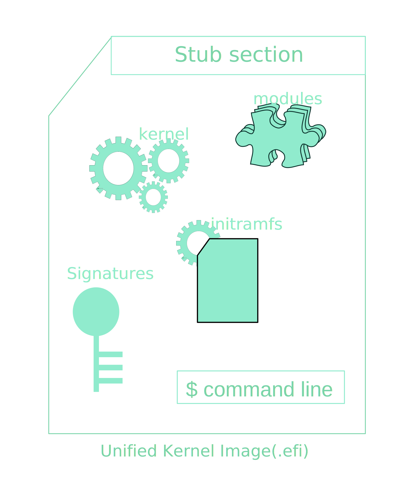
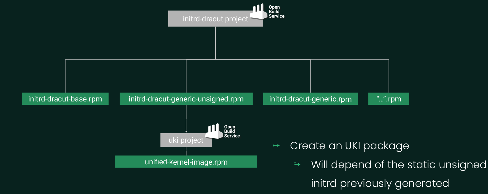
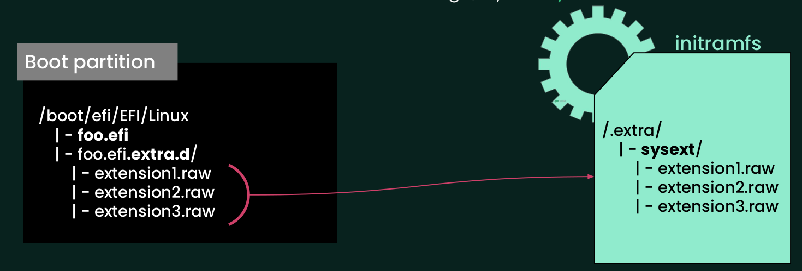
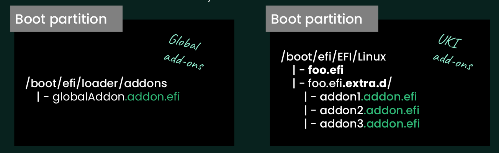
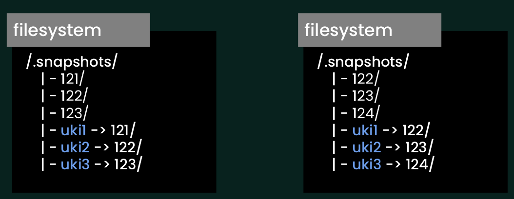

# Unified Kernel Image

> * **Author**: Valentin LEFEBVRE <valentin.lefebvre@suse.com>
> * **Created at**: 2024-04-21
> * **Updated at**: 2024-04-21
> * **Description**: Overview of the Unified Kernel Image

## I -definitions

It is an **all-in-one** efi binary conaining all stuf to boot by a bootloader.



* **stub section**: created by systemd-stub, it contains some discoverable mechanisms and act like a bootloader.
* **Kernel** and their **modules**
* **static initramfs**
* **kernel cmdline**
* other ressources...

It allows a centralized build, where the initramfs could be built by the vendor (see [static initramfs doc](./static-initramfs.md)), and every component will be sign at the same time. Therefore, the distribution becomes **more robust and more secure**.

## II - Mechanisms

* Automatic Discovery (Discoverable Partitions Specifications)
  * Previously on kernel command, you needed to provide the Partition Uuid where your root filesystem is store : `--kernel-cmdline “rw root=UUID=${root_dev_uuid}”`
  * Now that the kernel cmdline is embedded into the UKI, we cannot change this argument. So there is a discovery tool `systemd-gpt-auto-generator`, executed when no “root=” in CMDLINE, during the boot initrd, that will fetch all partition and get the UUID where a root filesystem is found. This generator will only look for the root partition on the same physical disk where the EFI System Partition (ESP) is located.
* System Extension (Discoverable Disk Images)
  * systemd-stub provides a way to discover automatically extensions files
  * systemd-sysext will be executed in the boot initrd, get extensions files loaded by the stub and will extend the initramfs. The **systemd-sysext** module need to be pre-included into the initramfs.
* add-ons (Companion files)
  * systemd-stub provides a way to discover add-ons as for extensions
  * Made to extend dynamically the kernel cmdline or Device Tree Blobs.

## III - Build on OBS

### 1) Tools to build an UKI

#### Dracut

```bash
dracut 
    --confdir $(mktemp -d)
    --conf=file.conf  
    --kernel-image /boot/%{ker_name} 
    --kver %{uname} 
    --kmoddir /lib/modules/%{uname} 
    --fwdir /lib/firmware 
    --no-hostonly 
    --no-hostonly-cmdline 
    --no-hostonly-default-device 
    --kernel-cmdline "rw security=apparmor rd.multipath=0" 
    --omit "iscsi multipath memstack" 
    --show-modules 
    --add-drivers="fat vfat" 
    --filesystems="vfat ext4 xfs btrfs overlay" 
    --uefi
    --uefi-stub /usr/lib/systemd/boot/efi/linuxx64.efi.stub
    ./%{efi_name}-%{uname}.efi
```

Same as for the initramfs and it provides **uefi** argument that will generate an UKI after building a static initramfs. Unfortunately, we cannot directly create an efi from an already build initramfs.

#### Ukify

```bash
/usr/lib/systemd/ukify
    /usr/lib/modules/%{uname}/%{ker_name}
    /boot/initramfs-mkosi-%{uname}.unsigned
    --cmdline='rw security=apparmor rd.multipath=0'
    --uname=%{uname}
    --output=./%{efi_name}-%{uname}.efi
```

Provided by systemd and written in python, it generates an UKI from a pre-build initramfs and a pre-build kernel. It is made for that. At SUSE, it is provided by the package *systemd-experimental*, and started from systemd v253 with additionnal features in v254.

As it provides a lot of features around the UKI, I am going to use this tool to build a UKI in the OBS.

### 2) Project architeture



The UKI packaging will depend on the [static initramfs](./static-initramfs.md) one. Getting in dependance the unsigned initramfs built.

### 3) build and sign

* To build it, simply call the `ukify` in `%build` section.
* To sign we can re-use the signature process of OBS as done for the [**static initramfs**](./static-initramfs.md) project.
  * Use the `needssslcertforbuild` comment to the top of the specfile to tell OBS we are using the signing process
  * Get the certificates provided by OBS into the source directory
  * Use `BRP_PESIGN_FILES` macro to list files to sign.

The package could be found [here](https://build.opensuse.org/package/show/home:vlefebvre:unified/uki).

NB: a post-installation script is implemented to change the type of the file system partition from 8300 to 8304 and automatically add a new bootloader entry according to what you have in your system.

### 4) UKI Pachaging files

```bash
$ rpm -ql /[...]/x86_64/uki-0.1.0_k6.8.5-6.28.x86_64.rpm
/usr/lib/modules/6.8.5-1-default/uki-0.1.0.efi
/usr/share/unified/
/usr/share/unified/certs
/usr/share/unified/certs/uki-0.1.0-981EA8B3.crt
```

## IV - Extensions

Idea would be to give the possibility to specialize dynamically the initramfs. In that way we can maybe reduce the generic initramfs in building a "basic" initramfs, and build a list of extensions. It would be better also for the updates, to avoid updating the entire UKI just to update a specific part of the initramfs. The goal would be to update only extensions.

One of the mechanisms that use the UKI allows use to create extensions: **Discoverable Disk Images**.

### 1) Overview of extensions

* **systemd-sysext** is the tool from systemd that use these extensions. Theses entities can be in three kind of formats:
  * Plain Directory
  * Disk Image with GPT labels
  * Disk image lacking a partition table
  We will use the second one for our POC. Following [uapi site](https://uapi-group.org/specifications/specs/discoverable_partitions_specification/) we need to use a specific partition-UUID, and gives a corresponding "release-file" to identify the extension type.
* Extensions are raw images that will contains files to add to your system/initramfs filesystem, and have also the "release file" to identify itself.

### 2) Extensions for initramfs in boot

The STUB part of the UKI, provided by systemd-stub, is in charge to automatically get extensions, verify them and provides them to the initramfs where systemd-sysext will be executed. To do that, extension files need to be put in the boot partition, in the **extra directory** of a specific UKI (named: ${NAME_UKI}.extra.d/) and need to end by ".raw"



### 3) Create extensions

* mkosi can create well formated extensions. From my tests last year (beginning of 2023) it was a bit tedious to create one, and the size wasn't optimized.
* Using a script shell following theses steps:
  * 1st step Loop on all dependencies and get the list of installed files
  * 2nd step Remove files already included into the UKI
  * 3rd step Create the release file according OS-release
  * 4th step Create the disk raw image extensions
  It becomes one of the verbs of the tool `ukit`
  `ukit extension ...`

### 4) Build and sign an extension

A example of extension has been built and sign on OBS using the ukit tool. [See here](https://build.opensuse.org/package/show/home:vlefebvre:unified/uki-extension-strace) for the packaging.

```bash
$ rpm -ql /[...]/x86_64/uki-extension-strace-0.0.1-7.29.x86_64.rpm
/usr/share/unified/certs/981EA8B3-strace-ext.crt
/usr/share/unified/ext
/usr/share/unified/ext/strace-ext.raw
```

## V - Snapshots

### 1) snapshots overview

* Those are subvolumes of **btrfs** filesystem that allow systems recovery
* For SUSE distribution, they are created by the tool `snappper` and stored into the root directory `/.snapshots`
  
  ```bash
  $ ls /.snapshots/
  1  2  3  34  35  36  37  38  39  4  40  41  42  43  5  6  7  grub-snapshot.cfg
  ```

* Booting of a specific one required to update the kernel cmdline adding the **rootflags** option:
  `rootflags=subvol=@/.snapshots/42/snapshot`

### 2) add-ons

* As described earlier, add-ons are made to extend dynamically the kernel command line. As the cmdline is embedded into the UKI that can be signed, we will need them.
* The UKI's stub will automatically discover add-ons files, in the same way with extensions. Those files can be placed in two differents places.



### 3) UKI with snapshots

* Goals would be to use add-ons to boot on a specific snapshots at boot.
  * 1 bootloader entry = UKI + 1 add-on containing `rootflags=subvol=@/.snapshots/X/snapshot`
* There are some **Problems** with that:
  * 1) The way the UKI is made, all addons in the specifics directories are loaded. We cannot choose one of them. That means, we cannot create a bootloader entry that load one specific add-on to boot on a specific snapshot.
  * 2) **For secure boot**: As add-ons are companions files to the UKI, they need to be sign to have a boot chain secure. However, the ID of snapshots is incremented and generated in runtime, Therefore we cannot guess in advance Ids of them, so we cannot create and sign it in advance.

### 4) Choose specific add-on

To answer of the first issue, there is a work in progress in the systemd upstream to add third type of add-on. A type that would allow to choose the filepath to load as add-on. Pull Request of this could be found [here](https://github.com/systemd/systemd/pull/28057).
This new feature has been backported into the systemd package from the unified OBS project [here](https://build.opensuse.org/package/show/home:vlefebvre:unified/systemd).

### 5) Proposal to know snapshot IDs

The idea would be to know the snapshot IDs generated. Moreover, to boot on the machine, we don't need to have more than N (20) entries. So the proposal would be to have N (20) symbolic link with a known name as "uki1" to "ukiN" that link to the last N (20) snapshots generated as followed:



## VI - Create Image using UKI

* For the UKI project, the goal would be to create a distribution containing the UKI pre-installed and ready to use. Aeon (MicroOS Desktop) looks to be a good candidate.
* Let's start from the Aeon distribution creation on OBS [here](https://build.opensuse.org/package/show/devel:microos:aeon:images/aeon-self-installer)

### 1) KIWI configuration

* Changes done from the Aeon kiwi config file to include the UKI:
  * No need initrd_system
  * Cannot have an "install iso" if no initrd has been provided (not yet implemented from kiwi)
  * efi partition needs to be higher
  * Add the repository from where to install the uki
  * install the uki packages in "image" package section

```diff
--- ./test-aeon/aeon.kiwi
+++ ./test-aeon-uki/aeon-uki.kiwi
@@ -17,10 +17,11 @@
             image="oem"
             filesystem="btrfs"
             firmware="uefi"
-            initrd_system="dracut"
-            installiso="true"
+            initrd_system="none"
+            installiso="false"
             bootpartition="false"
             bootkernel="custom"
+            efipartsize="1000"
             devicepersistency="by-uuid"
             btrfs_root_is_snapshot="true"
             btrfs_root_is_readonly_snapshot="true"
@@ -38,6 +39,8 @@
                 <volume name="boot/writable"/>
                 <volume name="var" copy_on_write="false"/>
             </systemdisk>
+            <!-- Add 500M to the image to play with it -->
+            <size unit="M" additive="true">500</size>
             <oemconfig>
                 <oem-device-filter>/dev/ram</oem-device-filter>
                 <oem-multipath-scan>false</oem-multipath-scan>
@@ -52,6 +55,9 @@
             </machine>
         </type>
     </preferences>
+    <repository type="rpm-md" alias="home_vlefebvre_unified_sign">
+        <source path="obs://home:vlefebvre:unified:signer/devel_aeon"/>
+    </repository>
     <repository type="rpm-md" alias="devel_aeon">
         <source path="obs://devel:microos:aeon/openSUSE_Tumbleweed"/>
     </repository>
@@ -59,11 +65,14 @@
         <source path="obs://openSUSE:Factory/snapshot"/>
     </repository>
     <!-- List of packages to be installed as part of a chroot operation -->
+        <!-- <package name="Aeon-release"/> -->
     <packages type="image">
         <package name="live-add-yast-repos"/>
         <package name="patterns-aeon-base"/>
         <package name="dracut-kiwi-oem-repart"/>
         <package name="dracut-kiwi-oem-dump"/>
+        <!--- Unified Kernel Image -->
+        <package name="uki"/>
     </packages>
     <!-- Boostrap: packages to be installed first into a new (empty) root tree
     List the required components to support a chroot env-->
```

### 2) Scripts

#### script.sh

```bash
#======================================
# Unified Kernel Image
#--------------------------------------
# Add zypper repo to uki packages
zypper --gpg-auto-import-keys --non-interactive ar -f https://download.opensuse.org/repositories/home:/vlefebvre:/unified:/signer/devel_aeon/ unified_aeon
 
#Install uki in efi part
chroot_uname=$(find /lib/modules/*/vmlinuz | head -n 1 \
    | sed -e 's|/lib/modules/\(.*\)/vmlinuz|\1|g')
efi_dir="/boot/efi/EFI/opensuse"
kernel_module_dir="/usr/lib/modules/$chroot_uname"
efi_file=$(basename "$kernel_module_dir"/uki-opensuse-*.efi)
if [ ! -e "$efi_file" ]; then
    kernel_module_dir="/lib/modules/$chroot_uname"
    efi_file=$(basename "$kernel_module_dir"/uki-opensuse-*.efi)
fi
echo "[TEST VAL] efi_file: $efi_file, kernel_module_dir: $kernel_module_dir"
if [ ! -e "$efi_file" ]; then
    echo "Unified Kernel Image Config"
    if [[ ! -d "$efi_dir" ]]; then
        mkdir -p "$efi_dir"
    fi
    cp "${kernel_module_dir}/${efi_file}" "${efi_dir}/${efi_file}"
else
    echo "No efi file installed"
    exit 1
fi
 
# Add menuentry to uki
mv /etc/grub.d/10_linux /etc/grub.d/11_linux
grub_conf_file="/etc/grub.d/10_uki"
cat <<"ENDOFFILE" >"$grub_conf_file"
#!/bin/sh
set -e
UKI=$(basename /boot/efi/EFI/opensuse/uki-opensuse-*.efi)
boot_efi_uuid=$(grub2-probe --target=fs_uuid /boot/efi)
 
echo "menuentry '$GRUB_DISTRIBUTOR with $UKI' {"
cat << EOF
    insmod part_gpt
    insmod btrfs
    insmod chain
    search --no-floppy --fs-uuid --set=root $boot_efi_uuid
    echo "Loading unified kernel image $UKI ..."
    chainloader /EFI/opensuse/$UKI
}
EOF
ENDOFFILE
chmod +x "$grub_conf_file"
chmod -x /etc/grub.d/11_linux
 
# Remove uneeded initrd and vmlinuz
rm /boot/initrd*
rm /boot/vmlinuz*
```

This script appends at the end of the prepare step. Here we can copy our uki in the efi partition.

#### disk.sh

```bash
#!/bin/bash
 
# Put typecode to 8304 needed by the discovery tool by systemd (gpt-auto-root)
root_dev=$(basename "$(findmnt / -n --output SOURCE | cut -d '[' -f1)")
dev_path="/dev/${root_dev%*p?}"
root_part=${root_dev: -1}
echo "Change the partition n°${root_part} type of ${dev_path} in 8304"
sgdisk -t "$root_part:8304" "$dev_path"
```

### 3) Signing process

#### Build signer packages

* As we had installed the UKI package in the image creation, and the signature isn't in the database, we will not able to boot on it if secureboot is enabled. To resolve that, we will need to include the key, used to sign the UKI.
* UKI is sign by OBS "needssslcertsforbuild" feature. The certificate is dependent of the OBS project. So we need to build, in the same project (using osc linkpac) the list of following packages
  * grub2
  * shim
  * ovmf
  * uki
* Then the certificates used to sign the UKI will be included in the devel's flavor of ovmf build.

#### ovmf VM

* Here we will use the libvirt manager to run the created image in a VM. To do that we will need to use the devel's flavor of ovmf firmware from the package qemu-ovmf-x86_64 previously re-build. When creating the VM from the GUI of libvirt manager:
  * Click on 'Customize configuration before install" at the step to fill the name of the VM (Step 4 of 4)
  * On the overview section, go to the XML part
  * Change the "os" xml section (see below)
  * Apply and Begin Installation

```xml
<os>
  <type arch="x86_64" machine="q35">hvm</type>
  <loader readonly="yes" type="pflash">/usr/share/qemu/ovmf-x86_64-smm-devel-code.bin</loader>
  <nvram>/usr/share/qemu/ovmf-x86_64-smm-devel-vars.bin</nvram>
  <boot dev="hd"/>
</os>
```

### 4) OBS Project

#### Project

Previously, changes has been made to run locally with the kiwi-ng command. The goal is still to build the distribution in our build service. We can directly create a project with this config:

```bash
Type: kiwi
Repotype: staticlinks
Patterntype: none
```

#### Package

Then we can osc linkpac from the project devel:microos:aeon:images, and apply previous explained changes

From the kiwi config file, remove all repository section to put:

```xml
    <repository type="rpm-md" >
        <source path='obsrepos itories:/'/>
    </repository>
```

[Link of the package](https://build.opensuse.org/project/show/home:vlefebvre:unified:images)

### 5) Results

* Step 1: Install the qemu-ovmf from my devel repo:
  
  ```bash
  zypper ar https://download.opensuse.org/repositories/home:/vlefebvre:/unified:/devel_aeon unified
  zypper refresh && zypper in qemu-ovmf-x86_64
  ```

* Step 2: Download the latest raw image from <https://download.opensuse.org/repositories/home:/vlefebvre:/unified:/images/devel_aeon/>
* Step 3: Follow instruction at ovmf vm section to run the image in a Qemu VM
